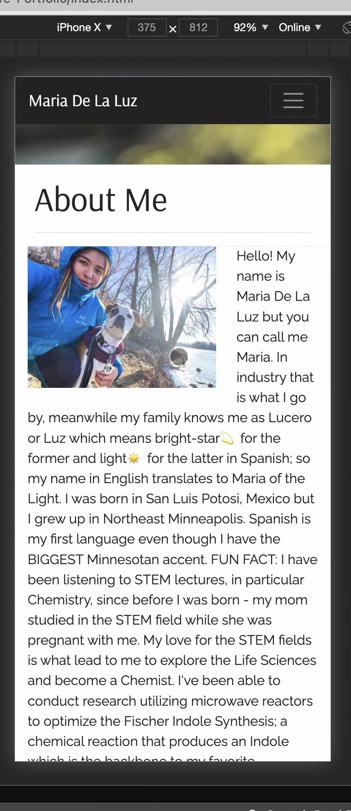
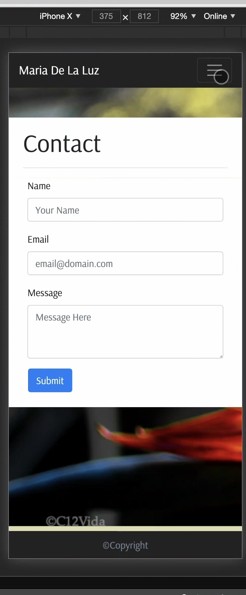
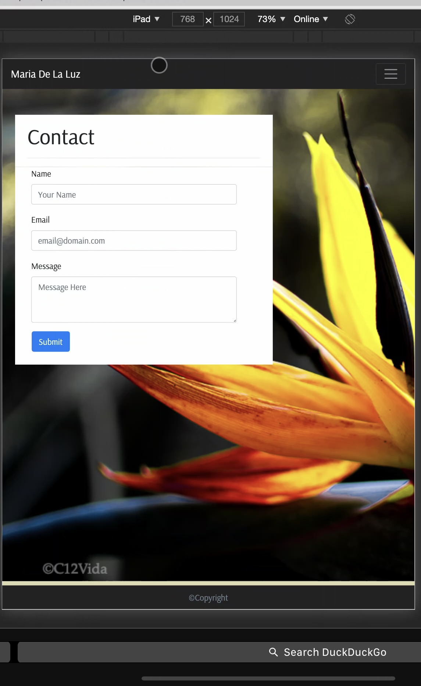
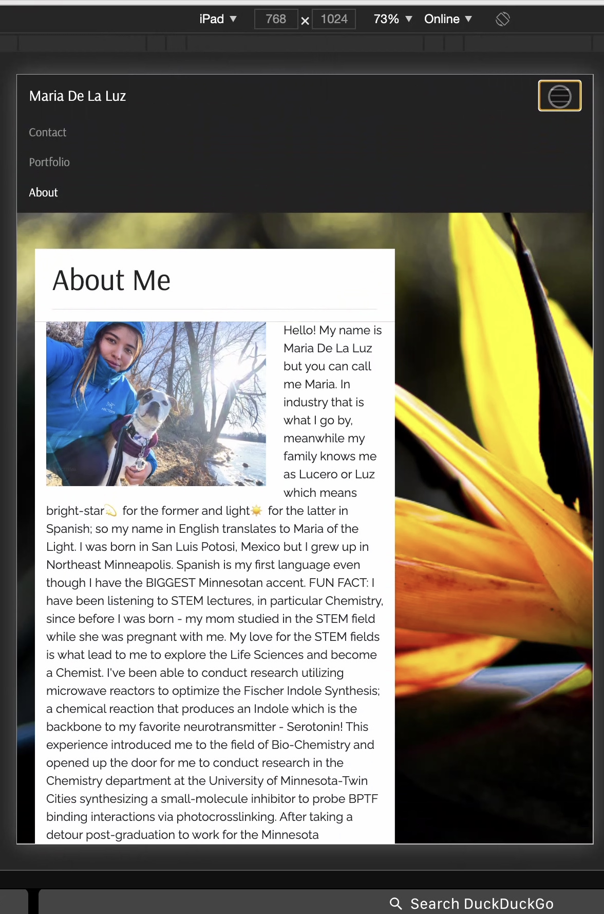
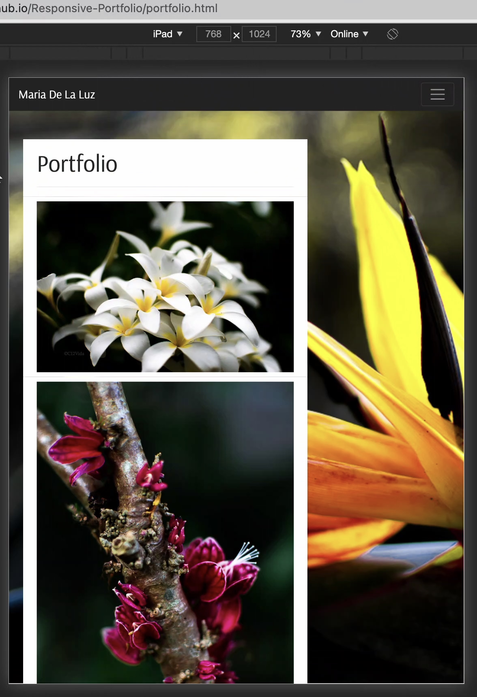
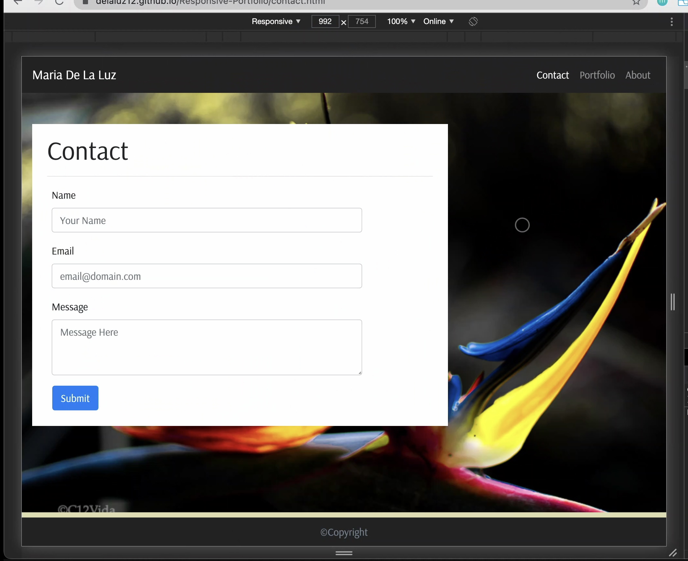
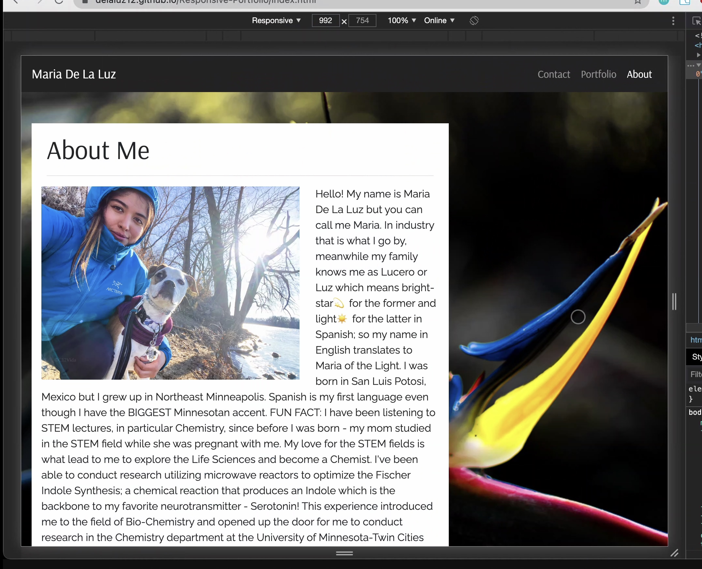

# Responsive-Portfolio

## Description
Created a responsive portfolio site that includes About Me, Portfolio, and Contact pages based on three different size designs provided (992, 764, 400). The site was created utlizing Bootstrap v4.5.

## Links

[Deployed Site](https://delaluz12.github.io/Responsive-Portfolio/)

[Site Respository](https://github.com/delaluz12/Responsive-Portfolio)

## Site Figures
Figures 1-3 will demonstrate responsiveness of portfolio site at the three different size screens - small, medium and large.

#### Figure 1-3: Screenshots of Portfolio Site on a small screen - iPhone X
     
    
    

 ##### Figures 4-6: Screenshots of Portfolio Site on a medium screen - iPad
    
    
    

#### Figures 7-9: Screenshots of Portfolio Site on a large screen
    
    
    

